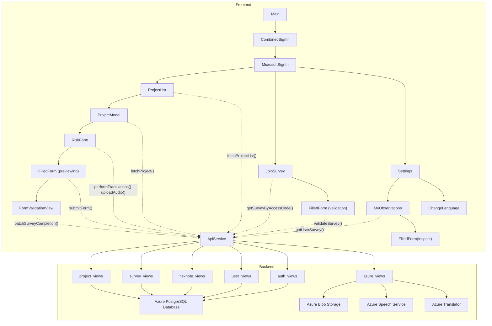

```mermaid
flowchart TD
  subgraph Frontend
    main["Main"]

    main --> login["CombinedSignIn"]
    login --> mslogin["MicrosoftSignIn"]
    mslogin --> projects["ProjectList"]
    projects --> projectmodal["ProjectModal"]
    projectmodal --> riskform["RiskForm"]
    riskform --> filledpreview["FilledForm (previewing)"]

    filledpreview --> validation["FormValidationView"]

    service["ApiService"]
    projects -."fetchProjectList()".-> service
    projectmodal -."fetchProject()".-> service
    riskform -."performTranslations() uploadAudio()".-> service
    filledpreview -."submitForm()".-> service
    validation -."patchSurveyCompletion()".-> service
    joinsurvey -."getSurveyByAccessCode()".-> service
    filledcheck -."validateSurvey()".-> service
    myobservations -."getUserSurvey()".-> service

    mslogin --> joinsurvey["JoinSurvey"]
    joinsurvey --> filledcheck["FilledForm (validation)"]

    mslogin --> settings["Settings"]
    settings --> myobservations["MyObservations"]
    myobservations --> filledinspect["FilledForm(Inspect)"]
    settings -->language["ChangeLanguage"]
  end

  subgraph "Backend"
      service --> project_views
      service --> survey_views
      service --> risknote_views
      service --> user_views
      service --> auth_views
      service --> azure_views

      azure_views --> BlobStorage[Azure Blob Storage]
      azure_views --> SpeechService[Azure Speech Service]
      azure_views --> Translator[Azure Translator]
      PostgreSQL[Azure PostgreSQL Database]
      project_views --> PostgreSQL
      survey_views --> PostgreSQL
      risknote_views --> PostgreSQL
      user_views --> PostgreSQL
      auth_views --> PostgreSQL
  end
```
