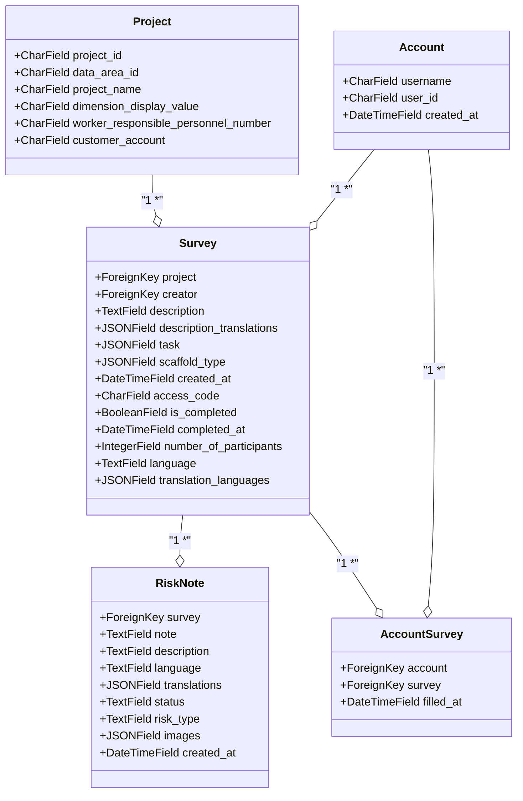

```mermaid

classDiagram

    class Project {
        +CharField project_id
        +CharField data_area_id
        +CharField project_name
        +CharField dimension_display_value
        +CharField worker_responsible_personnel_number
        +CharField customer_account
    }

    class Account {
        +CharField username
        +CharField user_id
        +DateTimeField created_at
    }

    class Survey {
        +ForeignKey project
        +ForeignKey creator
        +TextField description
        +JSONField description_translations
        +JSONField task
        +JSONField scaffold_type
        +DateTimeField created_at
        +CharField access_code
        +BooleanField is_completed
        +DateTimeField completed_at
        +IntegerField number_of_participants
        +TextField language
        +JSONField translation_languages
    }

    class RiskNote {
        +ForeignKey survey
        +TextField note
        +TextField description
        +TextField language
        +JSONField translations
        +TextField status
        +TextField risk_type
        +JSONField images
        +DateTimeField created_at
    }

    class AccountSurvey {
        +ForeignKey account
        +ForeignKey survey
        +DateTimeField filled_at
    }

    Account --o Survey : "1 *" 
    Project --o Survey : "1 *" 
    Survey --o RiskNote : "1 *"
    Survey --o AccountSurvey : "1 *" 
    Account --o AccountSurvey : "1 *" 
```
